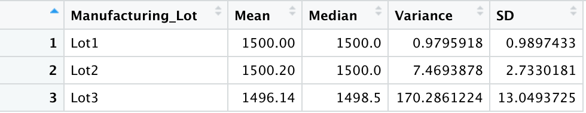

# MechaCar_Statistical_Analysis
Please see below for findings from the first experiment, where we performed multiple linear progression to observe the effect of multiple variables on MPG.

Two variables have an affect on MPG: 
- Vehicle_length
- Ground_clearance

These two independent variables are statistically significant due to their low p-values. They provided a low probability of random variance, meaning they are predictable in their effect on the dependent variable, MPG.

Check out the slopes of each variable and mpg below:

None of the slopes are exactly zero, but spoiler_angle does come pretty close.

Our data does fit the line fairly well, as we can see from our R-squared or correlation coefficient: Around 0.7 means this model fits about 70 percent of our data. The p-value being extremely small also bodes well, as that signals that our findings are in some way statistically significant. More analysis needed to really dig into those two variables listed above.

## Summary Statistics on Suspension Coils
Please see below for findings from the second experiment, where we calculated statistics on the PSI column, then performed the same statistics grouped by Manufacturing Lot.

#### Total Summary

#### Lot Summary

The design specifications for the MechaCar suspension coils dictate that the variance of the suspension coils must not exceed 100 pounds per square inch. If we look at the first figure, we see that overall we are not meeting that goal. However when we separate results by Manufacturing Lot, then we see that only one Lot is actually breaking this rule - Lot3. This suggests that we should look into what's going on at Lot3, but that Lots 1 and 2 are fine.

## T-Tests on Suspension Coils
Please see below for findings from the third experiment, where we performed a t test on our sample data to compare sample mean to the population mean of 1500. Then, we performed the same experiment split up by lots.

#### T-Test

All of our manufacutring lots had similar results to this. 
### Null: There is no statistical difference between the observed mean and its presumed population mean of 1500
### Alternative: There is a statistical difference between the observed mean and its presumed population mean of 1500
Looking at our p-value, which is greater than .05, we fail to reject the null hypothesis. Thus, this sample's PSI mean is not statistically different from the observed population's mean of 1500.

## Study Design: MechaCar vs Competition
There are certainly more avenues to explore when comparing MechaCar to its competition. Some values of interest are the following: cost, city or highway fuel efficiency, horse power, maintenance cost, or safety rating. Further research aims to assure the consumer that MechaCar performs the same, if not better than other similar cars. For example, in my next experiment, I could compare the cost of the car.

### Null: There is no statistical difference between the observed avergage MechaCar price and its presumed population average price
### Alternative: There is a statistical difference between the observed mean and its presumed population mean of average price

To complete this experiment, I would need the average price of comparable cars, then I would calculate the MechaCar's means, and perform a t-test to check for a statistical difference.